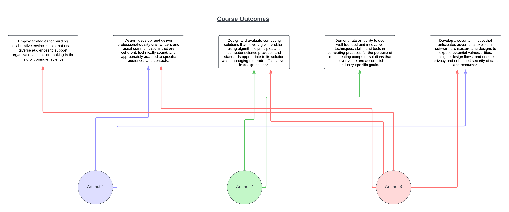

[Home](README.md) - [Code Review](CodeReview.md) - [Software Engineering and Design](SoftwareEngineering_Design.md) - [Data Structures and Algorithms](DataStructures_Algorithms.md) - [Databases](Database.md)

# Code Review 
In this code review I go over my enhancement plan for the three artifacts, and how they directly relate to the course outcomes. 
The YouTube link for my code review is [here.](https://youtu.be/5Qwit0IailM)

