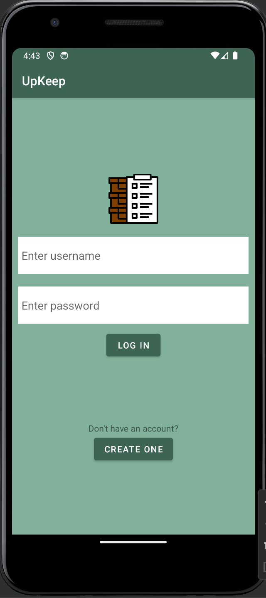
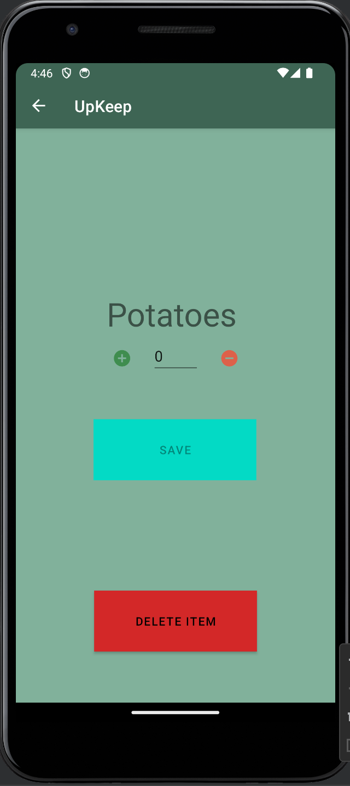
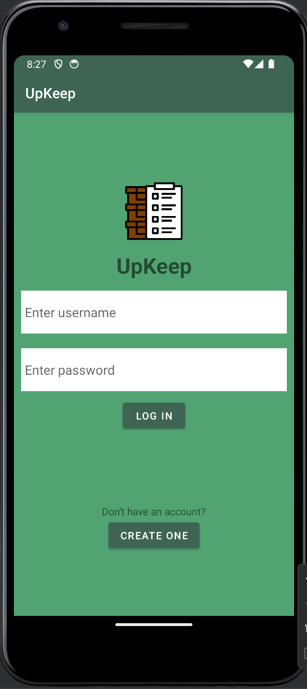
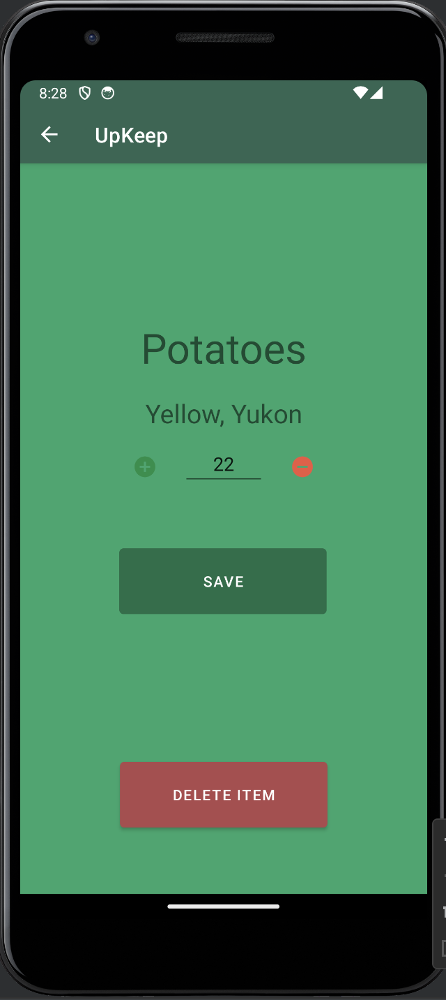

[Home](README.md) - [Code Review](CodeReview.md) - [Software Engineering and Design](SoftwareEngineering_Design.md) - [Data Structures and Algorithms](DataStructures_Algorithms.md) - [Databases](Database.md)

### Inventory App

# Narrative
The artifact was the Inventory application I made in CS-360 Mobile Architecture and Programming about 2 terms ago. The application serves as an inventory for keeping track of any items added. The main components are a login screen, an inventory screen, a screen for individual items, and a settings screen for push notifications. The enhancements I made revolved around re-working the overall UI, adding a field for details on the item screen, and making sure all inputs are validated. 

[This link](InventoryApp_Original.zip) goes to the original inventory project, before the enhancements were made.

# Enhancements 
The first enhancements made were mainly to the UI, where I altered the color scheme, fixed various grammar issues, and fixed errors directly affecting the flow of the application. There was issues with the item count not updating as well as fixed an empty list message. 

Next, I added the option to input a description on the item. 

These specific enhancements demonstrate my understanding of UI design principles and my ability to implement good choices for the user. This directly relates to the first course outcome achieved: "Design, develop, and deliver professional-quality oral, written, and visual communications that are coherent, technically sound, and appropriately adapted to specific audiences and contexts.". 

The last enhancement made was to the code. I added file headers, inline comments, and restructured some functionality so that it was not so redundant or cluttered. The following is an example of the ListItem.java that was commented on well with a full header file at the top. 

Markup : '

    //============================================================================
    // Name        : ListItem.java
    // Author      : Phillip Cabaniss
    // Version     : 1.0
    // Copyright   : Copyright © 2024 SNHU COCE
    // Description : Class that controls the functionality for an inventory item. Contains getters and
    //               setters for all the data within class.
    //============================================================================

    package com.zybooks.mainproject;

    import java.io.Serializable;

    // Custom list item
    public class ListItem implements Serializable{
    private long itemID;
    private String itemName;
    private String itemDescription;
    private int itemQuantity;

    /**
     * Default constructor
     */
    public ListItem() {}

    /**
     * Constructor that initializes new item at 0
     * @param id
     * @param name
     */
    public ListItem(long id, String name) {
        itemID = id;
        itemName = name;
        itemQuantity = 0;
        itemDescription = " ";
    }

    /**
     * Constructor for full item creation
     * @param id
     * @param name
     * @param quantity
     */
    public ListItem(long id, String name, String description, int quantity) {
        itemID = id;
        itemName = name;
        itemDescription = description;
        itemQuantity = quantity;
    }

    /**
     * Increment the amount by 1
     */
    public void increment() {
        this.itemQuantity++;
    }

    /**
     * Decrement the amount by 1
     */
    public void decrement() {
        if (itemQuantity > 0) {
            this.itemQuantity--;
        }
    }

    // Setters
    public void setId(long id) {
        this.itemID = id;
    }

    public void setName(String name) {
        this.itemName = name;
    }

    public void setQuantity(int quantity) {
        this.itemQuantity = quantity;
    }

    public void setItemDescription(String description) { this.itemDescription = description; }

    // Getters
    public long getId() {
        return itemID;
    }

    public String getName() {
        return itemName;
    }

    public String getItemDescription() {return itemDescription; }

    public int getQuantity() {
        return itemQuantity;
    }

    }'
This enhancement shows my ability to produce well-rounded code that is commented well. The restructuring of functions in the file shows my skills with understanding the structure of a program and how to alter it successfully. All of the minor errors were fixed in the process making this a polished, well-rounded application. This enhancement is an example of my second course outcome completed: "Employ strategies for building collaborative environments that enable diverse audiences to support organizational decision-making in the field of computer science."
